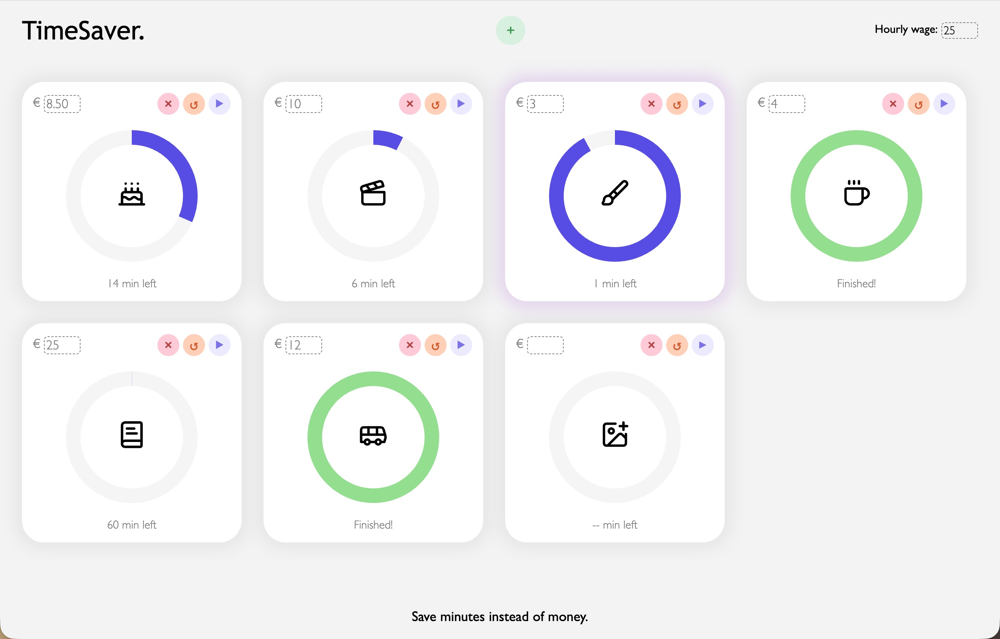

# TimeSaver.

## Description

This time tracker allows a user to calculate how many minutes they have to work for a specific saving goal and shows the progress visually in different cards for each goal.

Tech stack: HTML, CSS, vanilla JS

## Screenshot

## Demo

Live demo: https://p-ter-plekke.github.io/timesaver/ 
Repo on GitHub: https://github.com/p-ter-plekke/timesaver 

## Main Features

The TimeSaver works as follows:
* Add a card to the page with the green plus button.
* Set your hourly wage in the top right corner.
* Set the price of the thing you’re saving for in the top left corner of the card.
* Pick an icon that resembles your saving goal.
* Click play.
* The TimeSaver. calculates how many minutes you have to work for this goal. This is displayed at the bottom of the card.
* The card makes your progress visible with the purple ring that fills up and turns green when you’ve worked enough minutes.
* You can change the hourly wage and price of the card when a card is paused. It takes into account the already worked time when recalculating the needed minutes.
* You can restart and delete the card.

## Reflection

The idea behind TimeSaver came from a conversation with a friend who struggled to find motivation at work. She was saving up for gear to travel through Norway, and I suggested: "Wouldn't it be nice to work towards a specific goal, and track exactly how many minutes you need to work to get there?" I was looking for a project to build and decided this was gonna be it.

Some challenges I encountered:

* **Scalable cards**: I started with making one card work, then had to rewrite the code so the same functions could handle multiple cards and store the right state per card. I used an object with a state entry per card to achieve this. The original single-card script is still in the repo (script.js).
* **Event delegation**: Initially I attached a new event listener to every button of each new card added to the DOM. I later learned about event delegation, so now one listener on the card body handles which button was clicked.
* **Browser throttling**: I was incrementing elapsedSeconds++ on each interval tick, unaware that browsers throttle inactive tabs. I switched to Date.now() so the timer stays accurate even when running in the background.

## Future ideas

- Track how many times a goal has been reached (for example, how many coffees you've earned during worked time).
- Allow multiple timers to run at once, having the program dividing the hourly wage over the simultaneously running timers. 
- Add more icons to the icon picker.
- Turn the website into a web/mobile app.